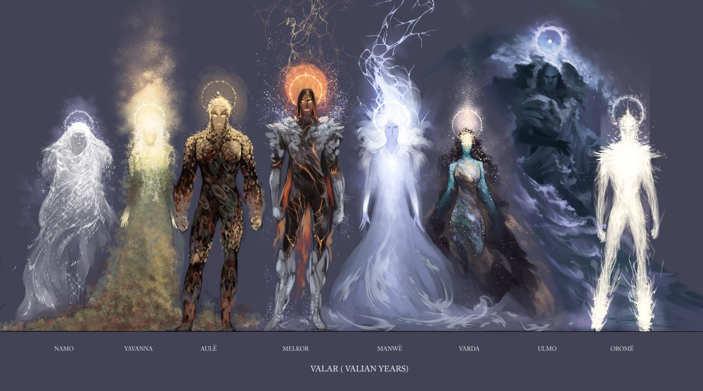

# todo
##### G.Kapanadze

#### 26 October 2021 Abastumani Observatory
- დაწერე თუდუ
- სია
- ✨Magic ✨

> კომენტი? Blockquotes
> ჰა?
> ნუ ჰო..

```
აქ აი ესე ჩაიწერება
- ✨Magic ✨

```
paragrap.

*****davboldoT*****
__davboled__
_davboldet_
___davboldet___

> ## აბა
> - ერთი
> - ორი
> ყველაფერი კარგად იქნება

1. პირველი
2. Second item
3. Third item
    1. Indented item
    2. Indented item
4. Fourth


- First item
- Second item
- Third item
    - Indented item
    - Indented item
- Fourth item


`nano` `// კოდებისთვის`

``Use `code` in your Markdown file.``

***
---
_______________________________

- ✨Magic ✨

###### ლინკები
My favorite search engine is [Duck Duck Go](https://duckduckgo.com).

My favorite search engine is [Duck Duck Go](https://duckduckgo.com "The best search engine for privacy"). // მაუსს რომ მიიტან დაეწერება სათაური :)


<https://www.markdownguide.org>
<fake@example.com>


In a hole in the ground there lived a hobbit. Not a nasty, dirty, wet hole, filled with the ends of worms and an oozy smell, nor yet a dry, bare, sandy hole with nothing in it to sit down on or to eat: it was a [hobbit-hole][1], and that means comfort.

[1]: <https://en.wikipedia.org/wiki/Hobbit#Lifestyle> "Hobbit lifestyles"


###### სურათები


